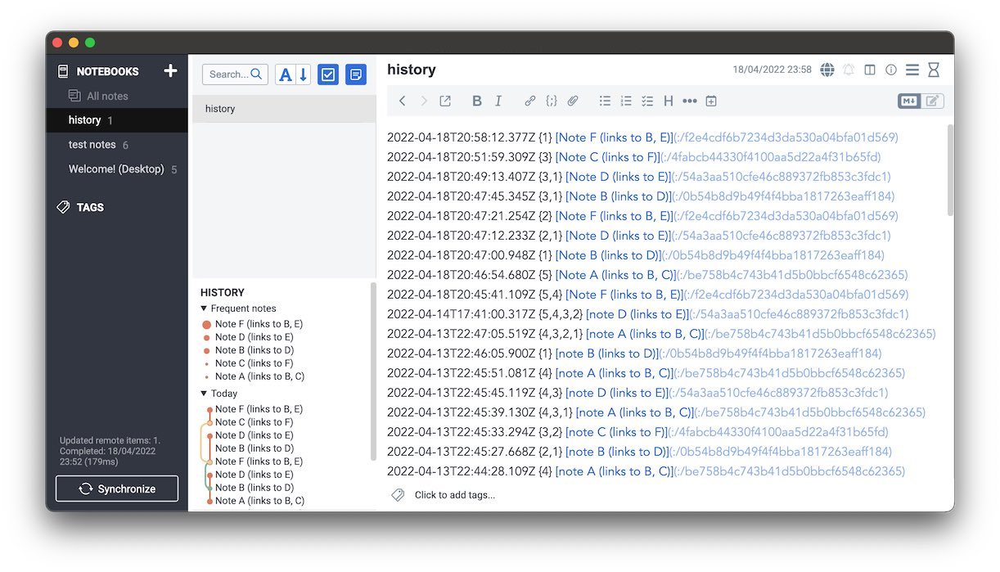

# The History Panel (Joplin Plugin)

Discussion: https://discourse.joplinapp.org/t/plugin-the-history-panel/24705

## Features

- Saves your Joplin note browsing history in a Joplin note.
- Displays note history in a dedicated panel.
- Displays links between history items in a "thought trails" view.
- Displays frequently visited notes.

## Preview

## Installation

1. Install the `History Panel` plugin from the Joplin app settings.
2. Create a new designated note to keep your history logs, which will be formatted and displayed in the history panel.
3. While this note is open, set your history note from the `Tools` menu --> `History` --> `Set history note`.
4. Set additional preferences in the `History Panel` settings dialog, such as the `Min seconds between history items` and the `Days of history to keep`.

## Use cases

The above setup enables some interesting use cases.

- View your (desktop) history on mobile by opening the history note.
- Sync and combine your history across devices.
- Keep separate histories for work, different projects and so on, by maintaining multiple history notes and switching between them during app use.
- [Backlinks / referrers](https://github.com/ylc395/joplin-plugin-note-link-system) will point back to all the visits of the currently viewed note that are documented in any of the history logs.
